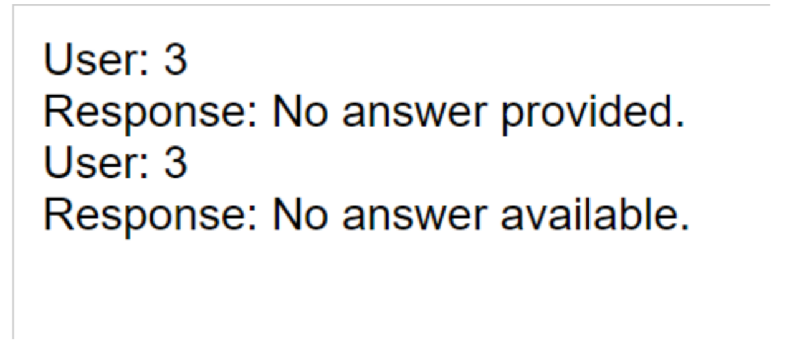

# End-to-end Website Deployment (Backend PostgreSQL/ChromaDB (Vector DB, RAG)/REST API + Frontend React.js + LLM Inference) on GCP Cloud Platform (Firewall, Portings, Protocols)


The report should contain the following broad sections: (i) Introduction, (ii) Methodology (iii) Conclusion 

## (i) Introduction

This repo is about Retrieval Augmented Generation (RAG) on novels. The goal of this project is to develop a Q/A system that revolves around a collection of novels. This system allows users to engage in chit-chat or seek specific information about a particular novel. A key aspect of this system is its ability to differentiate between general conversation and queries related to novels, thereby offering a tailored user experience.

## (ii) Methodology 

Data Collection:
I sourced at least 10 novels (I totally source 11 novels), including "The Adventures of Sherlock Holmes" by Arthur Conan Doyle, mainly from Project Gutenberg.

After sourcing these txt files, I write a python code to preprocess the unwanted format inside the txt files. For example, there are many copyright informations and unwanted promotion informations. So, I have to detect the pattern to know where’s the start of the article and where’s the end. To be specific, as I see “*** START OF THE PROJECT GUTENBERG EBOOK [BOOK_NAME]***” and “*** END OF THE PROJECT GUTENBERG EBOOK [BOOK_NAME]***”, the LLM and Vector Database should know the text between these 2 are very important knowledges to understand.

Then, when I want to use Langchain’s Data Loader function, I need to convert the original version of the txt file into the acceptable format, for example, Data Loader has been proved to use ASCII format. I then write another python code to process this.

### Chit-chat Language Model:
By utilizing a combination of pre-existing datasets and models such as DialoGPT, and Falcon-7b-instruct LLM from Hugging face. We can know that the difference among LLMs can be known as followings: DiagloGPT is a light-weight Language Model and has multiple disadvantages, while Falcon-7b-instruct has a very good performance but need much more computing resources. We can see from the input of Falcon-7b-instruct that if we input Falcon-7b-instruct as: query and well-searched-knowledge, we can get the right answer with the assistance of the searched knowledge from our search system. This search system is originally be built with elastic search and later being replaced by Chroma Vector Database.

### Topic Analysis:
For the Topic Analysis, I need to dive deep into what should literatures like novels can be constructed. 

First of all, I need to indexing and embedding the text into vector database. The process of how the vector embedding works can be explained as here: 


We can see here, in the screenshot, I retrieved several related text pieces by using the Chroma Vector Database. These pieces will be used in the later steps to generate a Topic-related response. We can see that we retrieve the text pieces by knowing what the query is. These retrieved knowledges are domain-specific, and hence are useful for generating response we want.


Now, I will demonstrate some queries that used in Topic Analysis, that can classify the Novel (if not provided already) from the query and restrict your chat in that specific novel. As we can see in this screenshot, it correctly answered our question: 


Furthermore, I implemented the mechanism to deal with “implement multi novel chat” mentioned in the instruction from the Information Retrieval course. My method for This "makes each different novel as an independent document" when added into the vector database. This answer gives a profound insight:

```
User: Compare and contrast the themes of reality versus illusion in 'The Great Gatsby' and 'Alice's Adventures in Wonderland.' How do these themes manifest through the characters of Jay Gatsby and Alice, and what impact do they have on the narrative and moral lessons of both stories?
Response: Gatsby and Alice both face illusions related to their desired realities. Gatsby's illusion is fuelled by his wealth, while Alice's is driven by her curiosity. These illusions lead to various moral lessons in both stories, such as the importance of cherishing reality over fantasy.
```


Implemented NLP techniques to classify user queries into general chat or specific novel-related questions.


### Q/A Bot Development:


To implement this, we have to know that how indexing and works in vector database. The vector database actually using approximate nearing neighbor (ANN) algorithms. Compared to traditional keyword search, vector search yields more relevant results and executes faster.

Approximate Nearest Neighbors (ANN) is a class of algorithms used to find the nearest neighbors of a query point in a high-dimensional dataset. These algorithms are called "approximate" because they trade off a small amount of accuracy for a significant speedup compared to exact nearest neighbor search algorithms. ANN algorithms are commonly used in applications such as recommendation systems, image retrieval, natural language processing, and more.

The general idea behind ANN algorithms is to preprocess the dataset to create an index or data structure that allows for efficient querying. When a query point is provided, the algorithm uses the index to quickly identify a set of candidate points that are likely to be close to the query point. This way, when querying the vector database to find the nearest neighbors of a query point, instead of computing distances between the query point and all vectors in the database, we only compute distances between the query point and the small number of candidate points around it.

### Error Handling
To dive more deep, we can see when I try to input 3 to the chat bot, it will correctly tell that there’s no answer for this without crashing.



## III. Conclusion
This project successfully culminated in the creation of a novel-centric Q/A system, equipped with a robust chit-chat component. The system adeptly handles user interactions, distinguishing between general conversations and novel-specific inquiries. The collaborative effort of the team has resulted in a user-friendly platform that caters to both casual conversations and detailed discussions about a wide range of novels. Future enhancements could include expanding the novel database, incorporating multilingual support, and further refining the AI to personalize user interactions.
The success of this project showcases the potential of AI in transforming how we interact with and access literary content, opening new avenues for digital engagement with literature.


